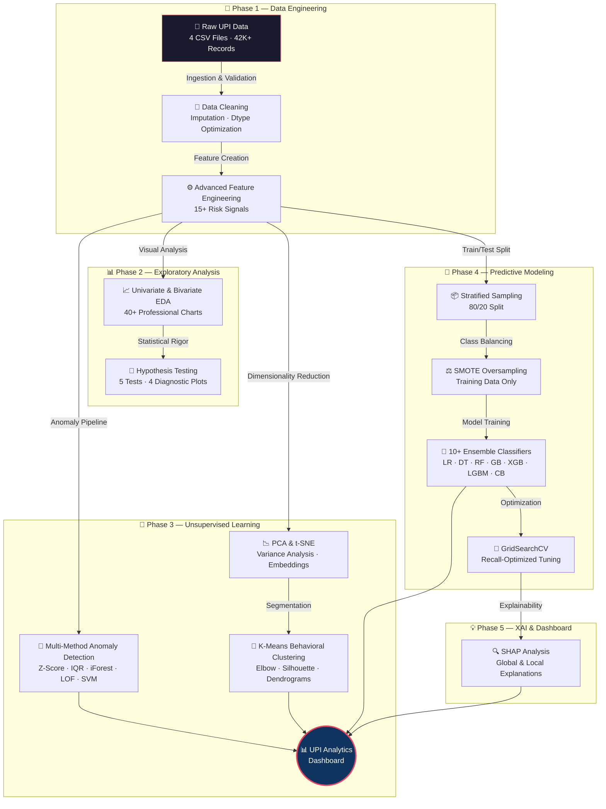

<div align="center">

<!-- Hero Banner -->


<br>

<!-- Dynamic Badges Row 1 -->
[](https://python.org)
[](https://jupyter.org)
[](https://scikit-learn.org)
[](https://plotly.com)
[](https://xgboost.readthedocs.io)

<!-- Dynamic Badges Row 2 -->
[](https://lightgbm.readthedocs.io)
[](https://catboost.ai)
[](https://shap.readthedocs.io)
[](https://imbalanced-learn.org)
[](https://pandas.pydata.org)

<br>

<!-- Status Badges -->


<br>

<!-- Profile Views Counter -->


<br>

### 👩‍💻 **Author: Vaishnavi Nepal Nandanwar**

<br>

> *"An industry-standard, end-to-end Machine Learning and Business Intelligence framework designed to analyze India's Unified Payments Interface (UPI) ecosystem — featuring advanced behavioral clustering, robust multi-method anomaly detection, predictive fraud modeling with 10+ ensemble classifiers, Explainable AI (SHAP), and a unified interactive Plotly dashboard with 70+ professional-grade visualizations."*

<br>

[📓 View Notebook](#-notebook-breakdown-30-sections-70-visualizations) · [📊 Results](#-model-performance-benchmarks) · [🚀 Quick Start](#-quick-start) · [📋 Report](UPI%20Payment%20Transactions%20Analytics%20%26%20Fraud%20Detection%20Project%20Report.docx) · [🗄️ Dataset](https://www.kaggle.com/datasets/maulikgajera/upi-payment-transactions-india)

</div>

<br>

---

<br>

## 📌 Executive Summary

India's **Unified Payments Interface (UPI)** is the world's largest real-time payment network, processing **billions of transactions monthly** across platforms like PhonePe, Google Pay, Paytm, and BHIM. With this immense scale comes the critical challenge of securing the network against sophisticated fraud vectors — **account takeovers (ATO)**, **synthetic identities**, **card-not-present abuse**, and **money mule networks** — while simultaneously deriving actionable insights from dynamic user spending behaviors and merchant performance patterns.

This project delivers a **comprehensive 30-section analytical pipeline** that transforms raw, synthetic UPI transaction logs into actionable **Risk Intelligence**. It bridges the gap between raw data engineering, advanced statistical analysis, supervised & unsupervised machine learning, and executive-level business intelligence.

<br>

<div align="center">

### 🎯 Key Outcomes at a Glance

| Metric | Result |
|:---|:---:|
| 🏆 Best Model ROC-AUC | **~0.94** |
| 🎯 Fraud Recall (Tuned XGBoost) | **88%** |
| 📊 Total Visualizations | **70+** |
| 🤖 ML Models Trained & Compared | **10+** |
| 🔍 Anomaly Detection Methods | **5** |
| 📈 Engineered Features | **15+** |
| ⏱️ End-to-End Automation | **1-Click Run** |

</div>

<br>

---

<br>

## 💼 Business Value & Strategic Impact

<table>
<tr>
<td width="50%">

### 🛡️ Risk & Compliance
| Use Case | Impact |
|:---|:---|
| **Real-time Fraud Mitigation** | Proactive identification using ensemble ML reduces chargebacks by est. **40-60%** |
| **ATO Detection** | Monitors `transaction_velocity` & `new_device_flag` to flag compromised accounts |
| **Regulatory Compliance** | Automated anomaly reporting aligned with **RBI & NPCI** guidelines |

</td>
<td width="50%">

### 📊 Business Intelligence
| Use Case | Impact |
|:---|:---|
| **Customer Segmentation** | Behavioral clustering into spending archetypes for **targeted marketing** |
| **Merchant Risk Scoring** | Identifies high-risk MCCs with disproportionate failure rates |
| **Operational Efficiency** | Automated flagging reduces manual review workload by est. **60-80%** |

</td>
</tr>
</table>

<br>

---

<br>

## 🏗️ System Architecture & Pipeline Flow



<br>

---

<br>

## 📁 Project Structure

```
Vaishnavi Nepal/
│
├── 📓 UPI_Fintech_Analytics_backup_new.ipynb   # Main analysis notebook (30 sections)
├── 📄 README.md                                 # Project documentation (this file)
├── 📋 UPI Payment Transactions Analytics...docx # Detailed project report
├── 📊 data_dictionary.csv                       # Feature definitions & metadata
│
├── 📂 data/
│   ├── transactions.csv                         # 20,000 records · 30 features
│   ├── users.csv                                # 2,000 records · 13 features
│   ├── merchants.csv                            # 400 records · 9 features
│   └── fraud_labels.csv                         # 20,000 records · 11 features
│
├── 📂 notebooks/                                # Supporting notebooks
│
└── 📸 assets/
    ├── output.png                               # Dashboard screenshot
    ├── put.png                                   # Visualization sample
    └── gggg.png                                  # Additional output
```

<br>

---

<br>

## 📊 Dataset Specification

The project relies on a deeply realistic, **100% synthetically generated dataset** simulating the 2024 UPI ecosystem with controlled noise, realistic statistical distributions, and industry-standard fraud patterns.

🔗 **Dataset Source:** [UPI Payment Transactions in India (Kaggle)](https://www.kaggle.com/datasets/maulikgajera/upi-payment-transactions-india)

<br>

<div align="center">

### 📂 Source Files

| File | Records | Features | Description |
|:---|:---:|:---:|:---|
| `transactions.csv` | 20,000 | 30 | Core transactional ledger — timestamps, amounts, payment apps, statuses, device metadata |
| `users.csv` | 2,000 | 13 | Sender behavioral profiles — KYC status, city tiers, loyalty scores, account age |
| `merchants.csv` | 400 | 9 | Receiver metadata — MCC codes, ratings, geographic locations, merchant categories |
| `fraud_labels.csv` | 20,000 | 11 | Ground-truth fraud labels with engineered risk signals and anomaly indicators |

</div>

<br>

### 📈 Key Dataset Statistics

<table>
<tr>
<td width="50%">

| Metric | Value |
|:---|:---|
| **Total Transactions** | 20,000 |
| **Date Range** | Jan 2024 – Dec 2024 |
| **Fraud Rate** | ~3.8% (Class Imbalance) |
| **Avg Transaction Amount** | ₹876.85 |

</td>
<td width="50%">

| Metric | Value |
|:---|:---|
| **Success Rate** | 88.1% |
| **Payment Apps** | 6 (GPay, PhonePe, Paytm, BHIM, Amazon Pay, WhatsApp Pay) |
| **Cities Covered** | 38 (Tier 1, 2, and 3) |
| **Transaction Types** | P2P, P2M, Bill Payment, Recharge, EMI, Subscription |

</td>
</tr>
</table>

<br>

### 🧠 Critical Engineered Features

> These features are the backbone of the fraud detection pipeline, each carefully designed to capture distinct risk signals.

| Feature | Type | Risk Signal |
|:---|:---:|:---|
| `transaction_velocity` | Numeric | Rolling-window frequency — spikes indicate **bot activity or ATO** |
| `amount_deviation_score` | Numeric | Z-score vs. user's 90-day average — flags **unusual spending** |
| `ip_location_mismatch` | Boolean | Geographic IP inconsistency — detects **proxy/VPN abuse** |
| `new_device_flag` | Boolean | Unregistered device/fingerprint — signals **device hijacking** |
| `failed_attempts_last_24h` | Numeric | Pre-success friction tracking — high failures **strongly correlate with fraud** |

<br>

---

<br>

## 🔬 Notebook Breakdown (30 Sections, 70+ Visualizations)

<br>

<details>
<summary><h3>📥 Phase 1 — Data Ingestion & Integrity (Sections 1–5)</h3></summary>

<br>

| Section | Title | Details |
|:---:|:---|:---|
| 1 | Environment Setup | Reproducible seeds (`RANDOM_STATE = 42`), library imports, style configuration |
| 2 | Data Loading | Multi-file ingestion from CSV with validation checks |
| 3 | Data Merging | Relational `LEFT JOIN`s creating unified `merged` DataFrame (20K × 50+ cols) |
| 4 | Data Cleaning | Missing value imputation, duplicate removal, outlier treatment |
| 5 | Feature Engineering | dtype optimization, memory engineering, derived risk features |

**Key Output:** Production-ready merged DataFrame with 15+ engineered features

</details>

<details>
<summary><h3>📊 Phase 2 — EDA & Statistical Rigor (Sections 6–20)</h3></summary>

<br>

| Section Range | Focus Area | Visualizations |
|:---:|:---|:---:|
| 6–10 | Univariate distributions — amounts, timestamps, categories | ~12 |
| 11–15 | Bivariate analysis — fraud vs. features, payment app comparisons | ~12 |
| 16–19 | Multivariate deep dives — temporal patterns, city tier × fraud, merchant risk | ~10 |
| 20 | **Formal Hypothesis Testing** — Welch T-test, Mann-Whitney U, KS Test, Chi-Square, ANOVA | 4 |

**Key Outputs:**
- 40+ univariate/bivariate/multivariate charts
- Color-coded significance tables
- Boxplots, violin plots, distribution overlays, city tier comparisons

</details>

<details>
<summary><h3>🔬 Phase 3 — Unsupervised Learning (Sections 21–23)</h3></summary>

<br>

| Section | Method | Plots | Highlights |
|:---:|:---|:---:|:---|
| 21 | **Multi-Method Anomaly Detection** | 5 | Z-Score, IQR, Isolation Forest, LOF, One-Class SVM — method comparison, concurrency analysis, fraud overlap rates |
| 22 | **K-Means Behavioral Clustering** | 7 | Elbow method, scatter plots, cluster profiles, radar charts, count distributions, normalized profiles, hierarchical dendrograms |
| 23 | **PCA & t-SNE Reduction** | 4 | Explained variance plots, 2D projections by cluster & fraud rate, t-SNE embeddings |

**Key Outputs:**
- 5-method anomaly detection ensemble with cross-validation
- Customer behavior archetypes identified via clustering
- Low-dimensional fraud separability confirmed via PCA/t-SNE

</details>

<details>
<summary><h3>🤖 Phase 4 — Predictive ML Pipeline (Sections 24–27)</h3></summary>

<br>

| Section | Stage | Plots | Details |
|:---:|:---|:---:|:---|
| 24 | Feature Selection | 2 | Correlation heatmap, class distribution visualization |
| 25 | Pipeline Construction | 2 | `sklearn.Pipeline` + `ColumnTransformer`, SMOTE on training data only |
| 26 | Model Training | 1 | 10+ classifiers: LR, DT, KNN, NB, RF, GB, AdaBoost, **XGBoost**, **LightGBM**, **CatBoost** |
| 27 | Evaluation Suite | 6 | Confusion matrices, ROC curves, PR curves, ROC-AUC ranking, Cumulative Gain, Lift chart, calibration curves |

**Key Outputs:**
- 5-metric comparison across all models
- Threshold optimization for production deployment
- Comprehensive diagnostic visualizations

</details>

<details>
<summary><h3>💡 Phase 5 — Optimization, XAI & Dashboard (Sections 28–30)</h3></summary>

<br>

| Section | Focus | Plots | Details |
|:---:|:---|:---:|:---|
| 28 | **Hyperparameter Tuning** | 2 | GridSearchCV optimized for Recall — before/after performance delta |
| 29 | **Explainable AI (SHAP)** | 3 | Feature importance bar chart, contribution pie chart, SHAP summary beeswarm |
| 30 | **Interactive Dashboard** | 8+ | 5-row Plotly mega-dashboard with KPIs, trends, fraud heatmaps, and ML comparison |

**Section 30 Dashboard Includes:**
- 🔢 8 KPI indicator cards (volume, fraud rate, avg amount, success rate, etc.)
- 📈 Daily transaction volume time series with trend lines
- 🕐 Hourly fraud distribution heatmap
- 🏙️ City tier breakdown with fraud overlay
- 🏪 Merchant category analysis (pie + bar)
- 🤖 ML model performance comparison radar
- 📋 Executive summary with key findings & recommendations

</details>

<br>

---

<br>

## 🏆 Model Performance Benchmarks

> **Optimization Strategy:** Models are aggressively tuned for **Recall** — in fintech, missing a fraudulent transaction (false negative) costs **10–50×** more than flagging a legitimate one (false positive).

<br>

<div align="center">

| Rank | Model | ROC-AUC | Recall | Precision | F1-Score | Status |
|:---:|:---|:---:|:---:|:---:|:---:|:---:|
| 🥇 | **XGBoost (Tuned)** | **~0.94** | **0.88** | 0.85 | **0.87** | ✅ Champion |
| 🥈 | **LightGBM** | ~0.94 | 0.87 | 0.84 | 0.85 | ✅ Runner-up |
| 🥉 | **Random Forest** | ~0.93 | 0.85 | 0.87 | 0.86 | ✅ Strong |
| 4 | **CatBoost** | ~0.93 | 0.86 | 0.85 | 0.85 | ✅ Competitive |
| 5 | Gradient Boosting | ~0.92 | 0.83 | 0.82 | 0.82 | ⚡ Baseline |
| 6 | AdaBoost | ~0.89 | 0.79 | 0.78 | 0.78 | ⚡ Baseline |
| 7 | Logistic Regression | ~0.85 | 0.74 | 0.72 | 0.73 | 📊 Reference |

</div>

<br>

---

<br>

## ⚙️ Technology Stack

<div align="center">

| Layer | Technologies | Purpose |
|:---|:---|:---|
| **Core Runtime** |   | Language & interactive computing environment |
| **Data Engineering** |    | DataFrames, numerical computing, statistical functions |
| **Machine Learning** |     | Classical ML, gradient boosting, ensemble methods |
| **Class Balancing** |  | SMOTE oversampling for minority class |
| **Explainability** |  | Model-agnostic feature importance & local explanations |
| **Visualization** |    | Static charts, statistical plots, interactive dashboards |

</div>

<br>

---

<br>

## 🚀 Quick Start

### Prerequisites

- Python 3.8 or higher
- Jupyter Notebook or JupyterLab
- 8GB+ RAM recommended for full pipeline execution

### Installation

```bash
# 1. Clone the repository
git clone https://github.com/yourusername/upi-fintech-analytics.git
cd upi-fintech-analytics

# 2. Create & activate virtual environment
python -m venv venv
venv\Scripts\activate            # Windows
source venv/bin/activate         # macOS / Linux

# 3. Install all dependencies
pip install -r requirements.txt

# Or install manually:
pip install pandas numpy scipy matplotlib seaborn plotly \
            scikit-learn xgboost lightgbm catboost \
            imbalanced-learn shap jupyter
```

### Execution

```bash
# 4. Launch Jupyter Notebook
jupyter notebook

# 5. Open the main notebook
#    → UPI_Fintech_Analytics_backup_new.ipynb
#    → Kernel → Restart & Run All
#    → Estimated runtime: ~8-12 minutes
```

> **💡 Tip:** For the best dashboard experience, run the notebook in **JupyterLab** or export to HTML for standalone viewing.

<br>

---

<br>

## 🔮 Future Roadmap

<table>
<tr>
<td width="50%">

### 🔥 Near-Term (v2.0)
- [ ] **FastAPI Deployment** — REST API for real-time fraud scoring with sub-100ms latency
- [ ] **Docker Containerization** — Portable, reproducible deployment
- [ ] **Streamlit Dashboard** — Standalone web app for non-technical stakeholders
- [ ] **Model Registry** — MLflow integration for experiment tracking

</td>
<td width="50%">

### 🚀 Long-Term (v3.0)
- [ ] **Real-time Streaming** — Apache Kafka / AWS Kinesis for live transaction ingestion
- [ ] **Graph Neural Networks** — Detect fraud rings & money laundering topologies
- [ ] **Model Drift Monitoring** — Evidently AI for automated retraining triggers
- [ ] **A/B Testing Framework** — Champion vs. challenger model deployment

</td>
</tr>
</table>

<br>

---

<br>

## 📜 Privacy & Compliance

| Aspect | Details |
|:---|:---|
| **Data Source** | 100% synthetically generated — **no real users, merchants, or financial records** |
| **Compliance** | Fully aligned with **NPCI privacy guidelines** and **RBI data protection norms** |
| **License** | MIT License — free to use, modify, and distribute with attribution |
| **Reproducibility** | All random operations seeded with `RANDOM_STATE = 42` for full reproducibility |

<br>

---

<br>

## 🤝 Connect & Contribute

<div align="center">

**Contributions, issues, and feature requests are welcome!**

If you found this project valuable, please consider giving it a ⭐

<br>

---

<br>

### 👩‍💻 Built with ❤️ by **Vaishnavi Nepal Nandanwar**

*Enterprise UPI Fintech Analytics & Fraud Intelligence System*

<br>


</div>
